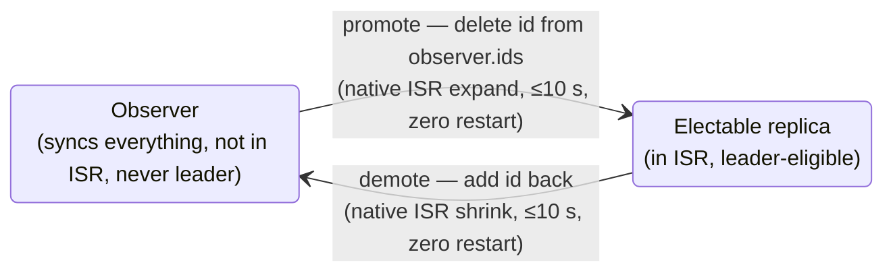

# sample-kafka-observer

[](LICENSE)
[](.github/workflows/build-verify.yml)
[](CHANGELOG.md)
[](docs/version-matrix.md)
[](docs/version-matrix.md)

**Observer/Learner replicas for Apache Kafka — an open reference implementation.**

Add a third replica state to open-source Apache Kafka: replicas that **fully sync data but never join the ISR** — so they never drag the high-watermark, never become leader, and can be **promoted to a fully electable replica in seconds, with zero restarts and zero data movement**.

> Every number in this repository was measured on real EC2 instances (Tokyo, up to 4 brokers + 3 controllers across 3 AZs, m7g.large). Evidence files with raw command output are in [`evidence/`](evidence/). How the design emerged across three POC iterations: [docs/design-story.md](docs/design-story.md).

**Production-recommended topology**: RF4 = 3 ISR members across 3 AZs + 1 observer in a remote AZ/DC. With `min.insync.replicas=2`, losing 1 AZ still leaves ISR ≥ minISR → **writes continue without promotion**. The observer is promoted only when 2+ AZs are lost simultaneously (extreme disaster). This is verified in our scenario matrix (`--replica-assignment 3:1:2:4`, see [evidence](evidence/scenario_matrix_evidence.md)). The minimum verified topology (RF3 = 2 ISR + 1 observer) is also fully tested — see [topology guide](docs/architecture.md#topology-guide).

## Why this exists

Some workloads — exchanges, payment ledgers, order books — need a **strongly consistent, byte-identical backup replica in a slow AZ or a remote site**, but cannot let that replica slow down the main write path. Vanilla Kafka forces a choice:

- Put the remote replica **in the ISR** → `acks=all` waits for it; the high-watermark is set by the slowest member; the main path inherits cross-AZ latency. (We measured this first: the config-only approach works for consistency but drags the HW.)
- Keep it **out of the replica set** and replicate cross-cluster (MirrorMaker 2 etc.) → *consume → re-produce*: the target reassigns offsets, so exactly-once is structurally impossible and client failover requires offset translation. Under one `kill -9` in the offset-flush window, our MM2 control group re-delivered **20,000 duplicate messages** ([evidence](evidence/mm2_duplicate_evidence.md)).

The industry solved this with a third replica state — a replica that syncs everything but is invisible to acks, HW, and elections:

- **Confluent Multi-Region Clusters (MRC) Observers** — commercial, closed source.
- **"Learner" replicas** inside some large tech companies — internal forks, not published.
- **Apache Kafka upstream** — nothing. KIP-929 "Observer Replicas" is a wiki page with a **zero-length body** (verified via the Confluence API): a placeholder, not a plan.

So users who need this today can buy Confluent, maintain a private fork, or use a maintained, auditable patch set. This project is the third option: **~60 lines of Scala across 5 hook points** (ZooKeeper mode; ~115 lines total with the KRaft controller side), all reusing Kafka's native ISR expansion/shrink machinery, with every claim backed by a raw evidence file. A same-cluster observer is *replicate-the-log*, not *consume → re-produce*: there is no second offset space, so exactly-once survives replication for free — see [docs/eos-semantics.md](docs/eos-semantics.md) and the [industry comparison](docs/industry-comparison.md).

## What you get

| Capability | Mechanism | Verified |
|---|---|---|
| Sync all data, never join ISR | Gate in `canAddReplicaToIsr()` | ✅ `Isr: 2,3` while `Replicas: 2,3,1` |
| Never drag the high-watermark | Gate in `maybeIncrementLeaderHW` | ✅ acks=all 2.04–2.35 ms with observer in the slowest AZ |
| Never become leader (incl. unclean) | Excluded from initial ISR + unclean election | ✅ kill all ISR → `Leader: none` |
| **Promote** (observer → electable) | Remove id from `/opt/kafka/observer.ids` → next fetch passes the gate → native ISR expand | ✅ ≤10 s, zero restart |
| **Demote** (electable → observer) | Add id back → native `isr-expiration` task shrinks it out | ✅ ≤10 s, zero restart |
| Promoted replica leads & serves | Full election eligibility restored | ✅ kill all ISR → `Leader: 1`, write + read OK |
| Exactly-once preserved | `appendAsFollower` byte-copies leader batches — offsets, PID, epoch, sequence, txn markers | ✅ per-batch CRC identical; `read_committed` view identical; MM2 control group produced 20 000 duplicates under the same failure |

## Architecture

<p align="center">
  
</p>

The observer runs the native follower fetch protocol and holds a byte-identical copy of the log, but gates at the ISR boundary keep it out — so it never slows `acks=all`, never counts toward `min.insync.replicas`, and can never be elected leader (not even unclean). Promotion and demotion are a one-line edit to a file, picked up live:



Why "not in ISR" implies everything else, the 5 hook points, and the promotion/demotion sequence diagrams: [docs/architecture.md](docs/architecture.md) · monitoring guidance: [docs/monitoring-alerting.md](docs/monitoring-alerting.md).

## Quick start

```bash
# 1. Get clean Kafka source (3.7.1 shown; use 4.0.0/4.1.0 with the matching patch dir — see docs/multi-version.md)
git clone --depth 1 --branch 3.7.1 https://github.com/apache/kafka.git kafka-src

# 2. Apply the patch (ZK-only: kafka-3.7.1-zk; combined ZK+KRaft: kafka-3.7.1-kraft;
#    Kafka 4.x: kafka-4.0.0-kraft / kafka-4.1.0-kraft)
cd kafka-src && git apply --3way ../patches/kafka-3.7.1-zk/observer.patch

# 3. Build (needs JDK 17 with javac; ~1–3 min on 4 vCPUs)
./gradlew :core:jar -x test          # ZK-only patch
# ./gradlew :core:jar :metadata:jar :storage:jar -x test   # KRaft / combined patches

# 4. Deploy: replace kafka_2.13-3.7.1.jar and kafka-storage-3.7.1.jar on every broker
#    (KRaft: also kafka-metadata-*.jar, on controller nodes too),
#    create /opt/kafka/observer.ids containing the observer broker ids, rolling restart.

# 5. Verify
kafka-topics.sh --describe --topic your_topic   # observer id absent from Isr
```

Prefer a laptop? `cd docker && docker compose up -d && ./demo.sh` walks the full lifecycle on a local 3-broker cluster ([docker/README.md](docker/README.md)). Full deployment guide including rolling-replacement SOP: [docs/deployment.md](docs/deployment.md).

## ZooKeeper vs KRaft

Both modes are supported with identical observer semantics, file format, and runbooks — the capability survives a ZK→KRaft migration with no gap. The mechanics differ where the control plane differs:

| | ZooKeeper mode (3.6–3.9) | KRaft mode (3.7.1 / 4.0 / 4.1) |
|---|---|---|
| Broker-side hooks | `Partition.scala` × 3 (promotion gate, demotion hook, HW gate) | **Identical** — same file is shared by both modes; anchors byte-identical 3.6.2 → 4.1.0 |
| Controller-side hooks | `PartitionStateMachine.scala` × 2 (Scala: initial ISR, unclean election) | `ObserverReplicas.java` + 3 hooks in `ReplicationControlManager` (Java, `metadata` module); `LeaderAcceptor.test` covers **all 7 election entry points with one line** |
| Patch size | ~60 lines | ~115 lines |
| Jars to deploy | `core` + `storage` | `core` + `storage` + `metadata` — **on controller quorum nodes too** |
| `observer.ids` distribution | all brokers (controller is a broker) | all brokers **and** controller nodes; when promoting, update controllers *first* (a broker-first mismatch fails safe: AlterPartition rejected `INELIGIBLE_REPLICA` until consistent) |
| New-topic gotcha | Observer never learns a new topic's assignment while running (controller notifies ISR members only) — restart the observer once after creating topics that span it | **No such limitation** — brokers read assignments from the metadata log (probe-verified) |
| Demoting a *leader* observer | Move leadership first (native shrink never removes the leader) | **Stricter**: hot demotion of a leader never takes effect (no ZK-style re-election path) — move leadership first or restart that broker once |
| Extra defense | — | AlterPartition requests from observers rejected controller-side (`INELIGIBLE_REPLICA "observer"`) even if a broker gate is missing |
| ELR (KIP-966) | n/a | Observers structurally never enter ELR (candidate set = `ELR ∪ ISR`); verified on 4.0 (manually enabled) and 4.1 (default-on). Use 4.1.0 for ELR (carries the KAFKA-19522 fix) |

Full hook matrix, hunk-by-hunk 4.x port analysis, and the KRaft probe that discovered the controller-side gap: [docs/multi-version.md](docs/multi-version.md).

## Failure playbook

Every scenario below was executed on real clusters — the playbook indexes what was run, what happened, and where the raw output lives: [docs/scenario-playbook.md](docs/scenario-playbook.md).

- **Scenario A — one primary AZ down**: writes fail-stop (`NOT_ENOUGH_REPLICAS`) → delete observer id from the file → observer joins ISR in ≤10 s → writes resume. No data movement (it was byte-identical all along). RPO = 0. [runbook](docs/runbooks/scenario-a-az-loss.md)
- **Scenario B — all primary replicas down**: un-promoted observer is *never* elected (`Leader: none`, even with unclean election enabled) → promote it → it is elected leader and serves reads/writes. [runbook](docs/runbooks/scenario-b-total-loss.md)
- Pre-checks, multi-observer layouts, KRaft-specific rules: [docs/runbooks/](docs/runbooks/)

## Version support — the full real-machine matrix

**Every version below was compiled, deployed, and taken through the complete S1–S8 failure
scenario suite on real EC2 instances** (Tokyo `ap-northeast-1`, Graviton `m7g`), not just
"patch applies." Each cell is backed by a raw evidence file in
[`evidence/version-matrix/`](evidence/version-matrix/). Full matrix write-up and the
per-scenario timing table: [docs/version-matrix.md](docs/version-matrix.md).

**Supported floor is Kafka 2.7.** See [Why 2.7 is the floor](#why-27-is-the-earliest-supported-version) below — it is a structural boundary (KIP-497), not a packaging gap.

### ZooKeeper mode (2.7 → 3.9)

| Kafka | Patch | Compile | S1–S8 real-machine | Evidence |
|---|---|---|---|---|
| 2.7.2 | [`kafka-2.7.2-zk`](patches/kafka-2.7.2-zk/) | ✅ | ✅ **8/8** | [zk-2.7.2](evidence/old-versions-real-machine/scenario-2.7.2.txt) |
| 2.8.1 / 2.8.2 | [`kafka-2.8.1-zk`](patches/kafka-2.8.1-zk/) · [`2.8.2`](patches/kafka-2.8.2-zk/) | ✅ | ✅ **8/8** | [2.8.1](evidence/old-versions-real-machine/scenario-2.8.1.txt) · [2.8.2](evidence/old-versions-real-machine/scenario-2.8.2.txt) |
| 3.0.2 | [`kafka-3.0.2-zk`](patches/kafka-3.0.2-zk/) | ✅ | ✅ **8/8** | [zk-3.0.2](evidence/version-matrix/zk-3.0.2.txt) |
| 3.1.2 | [`kafka-3.1.2-zk`](patches/kafka-3.1.2-zk/) | ✅ | ✅ **8/8** | [zk-3.1.2](evidence/version-matrix/zk-3.1.2.txt) |
| 3.2.3 | [`kafka-3.2.3-zk`](patches/kafka-3.2.3-zk/) | ✅ | ✅ **8/8** | [zk-3.2.3](evidence/version-matrix/zk-3.2.3.txt) |
| 3.3.2 | [`kafka-3.3.2-zk`](patches/kafka-3.3.2-zk/) | ✅ | ✅ **8/8** | [zk-3.3.2](evidence/old-versions-real-machine/scenario-3.3.2.txt) |
| 3.4.1 | [`kafka-3.4.1-zk`](patches/kafka-3.4.1-zk/) | ✅ | ✅ **8/8** | [zk-3.4.1](evidence/version-matrix/zk-3.4.1.txt) |
| 3.5.2 | [`kafka-3.5.2-zk`](patches/kafka-3.5.2-zk/) | ✅ | ✅ **8/8** | [zk-3.5.2](evidence/version-matrix/zk-3.5.2.txt) |
| 3.6.2 | [`kafka-3.6.2-zk`](patches/kafka-3.6.2-zk/) | ✅ | ✅ **8/8** | [zk-3.6.2](evidence/version-matrix/zk-3.6.2.txt) |
| 3.7.2 | [`kafka-3.7.2-zk`](patches/kafka-3.7.2-zk/) | ✅ | ✅ **8/8** | [zk-3.7.2](evidence/version-matrix/zk-3.7.2.txt) |
| 3.8.1 | [`kafka-3.8.1-zk`](patches/kafka-3.8.1-zk/) | ✅ | ✅ **8/8** | [zk-3.8.1](evidence/version-matrix/zk-3.8.1.txt) |
| 3.9.2 | [`kafka-3.9.2-zk`](patches/kafka-3.9.2-zk/) | ✅ | ✅ **8/8** | [zk-3.9.2](evidence/version-matrix/zk-3.9.2.txt) |

### KRaft mode (3.7 → 4.3)

| Kafka | Patch | Compile | S1–S8 real-machine | Evidence |
|---|---|---|---|---|
| 3.7.2 | [`kafka-3.7.2-kraft`](patches/kafka-3.7.2-kraft/) | ✅ | ✅ **8/8** | [kraft-3.7.2](evidence/version-matrix/kraft-3.7.2.txt) |
| 3.8.1 | [`kafka-3.8.1-kraft`](patches/kafka-3.8.1-kraft/) | ✅ | ✅ **8/8** | [kraft-3.8.1](evidence/version-matrix/kraft-3.8.1.txt) |
| 3.9.2 | [`kafka-3.9.2-kraft`](patches/kafka-3.9.2-kraft/) | ✅ | ✅ **8/8** | [kraft-3.9.2](evidence/version-matrix/kraft-3.9.2.txt) |
| 4.0.2 | [`kafka-4.0.2-kraft`](patches/kafka-4.0.2-kraft/) | ✅ | ✅ **8/8** | [kraft-4.0.2](evidence/version-matrix/kraft-4.0.2.txt) |
| 4.1.2 | [`kafka-4.1.2-kraft`](patches/kafka-4.1.2-kraft/) | ✅ | ✅ **8/8** | [kraft-4.1.2](evidence/version-matrix/kraft-4.1.2.txt) |
| 4.2.1 | [`kafka-4.2.1-kraft`](patches/kafka-4.2.1-kraft/) | ✅ | ✅ **8/8** | [kraft-4.2.1](evidence/version-matrix/kraft-4.2.1.txt) |
| 4.3.1 | [`kafka-4.3.1-kraft`](patches/kafka-4.3.1-kraft/) | ✅ | ✅ **8/8** | [kraft-4.3.1](evidence/version-matrix/kraft-4.3.1.txt) |

> KRaft has no ZooKeeper (removed upstream in 4.0), so 4.x is KRaft-only. 3.7–3.9 support **both** modes — pick per your cluster.
> The S1–S8 suite: **S1** leader crash · **S2** ISR follower crash · **S3** observer crash (byte-identical log proven by per-segment md5) · **S4** all-primaries-down → promotion · **S5** lagging-observer promotion (HW never regresses) · **S6** `observer.ids` node-inconsistency (fail-safe) · **S7** file corruption/permission/deletion (broker never crashes) · **S8** controller failover. Timings are consistent across all versions: leader failover ~9–12 s (`≈ replica.lag.time.max.ms` + election), promotion ~10.5 s, lagging catch-up ~3–7 s.

### Do I need a different patch per version?

**Yes — one patch family per source-structure generation, not one patch for everything.**
A patch is a context-anchored diff, and Kafka's source was refactored several times
(KIP-497 added AlterIsr in 2.7; 4.0 deleted the ZK controller; 4.2 moved partition state
to Java). The **5 hook points are semantically identical across every version** — only line
numbers/context drift — so each version gets its own re-anchored patch, already generated and
verified in [`patches/`](patches/). Within a minor line the patch is reused verbatim (e.g.
2.8.1 and 2.8.2 are byte-identical). **Just download the patch dir matching your exact version.**

### Tunable timing (all defaults, all configurable)

| Knob | Default | Effect | Where |
|---|---|---|---|
| `replica.lag.time.max.ms` | 10000 ms (we used) / 30000 upstream | Leader failover time ≈ this + election; also gates demotion | broker config |
| `observer.ids` cache TTL | 5 s (hardcoded) | Promotion/demotion effective latency after editing the file | `ObserverIds.scala` `CacheTtlNanos` — recompile to change |
| isr-expiration period | `replica.lag.time.max.ms / 2` | How fast a demoted broker leaves ISR | derived |
| auto-promoter scan interval | 10 s | Auto-detect delay for unattended promotion (S4b) | `observer-auto-promoter.sh -i` |

### Why 2.7 is the earliest supported version

The patch's core gate is the leader-side method `canAddReplicaToIsr`. It was **introduced with
KIP-497 (AlterIsr) in Kafka 2.7**, which changed ISR management from "leader writes ZooKeeper
directly" to "leader requests the controller via the AlterIsr API." Before 2.7 that method does
not exist, so the patch's central hook has nowhere to attach — this is a **structural
incompatibility, not a missing adaptation.** Confirmed by real-machine function probing:

| Kafka | `canAddReplicaToIsr` | ISR model | Result |
|---|---|---|---|
| 2.4.1 / 2.5.1 / 2.6.3 | ❌ absent | leader-writes-ZK (old) | **Not supported** — no hook site |
| **2.7.x** and later | ✅ present | AlterIsr / KRaft | ✅ Supported (verified through 4.3) |

Older releases (≤ 2.6) would require a fundamentally different mechanism and are out of scope.

## Operability

Shipped in v0.7 and verified end-to-end (JMX readings + fault injection) on a live patched KRaft cluster — raw output in [evidence/v07_operability_evidence.md](evidence/v07_operability_evidence.md). Full monitoring guidance: [docs/monitoring-alerting.md](docs/monitoring-alerting.md).

**JMX metrics** — 7 gauges layered on the v0.6 combined patch as [`patches/kafka-3.7.1-kraft-v07/observer.patch`](patches/kafka-3.7.1-kraft-v07/) (functional hooks byte-identical to v0.6; v0.7 only adds the ability to *see*, not new behavior):

| MBean | Level | Semantics (as measured) |
|---|---|---|
| `kafka.observer:type=ObserverMetrics,name=ObserverCount` | broker | Size of this node's `observer.ids` view — compare across nodes to detect file drift. Lazily registered: absent on a broker that leads no partitions |
| `kafka.server:type=ReplicaManager,name=ObserversInIsrCount` | broker (leader view) | **Steady state 0.** Non-zero only during a demotion transition (~5 s measured window) or a real gate bypass / file inconsistency — the highest-value alert metric. Alert on `> 0` sustained beyond 2× `replica.lag.time.max.ms` |
| `kafka.server:type=ReplicaManager,name=ObserverCaughtUpCount` | broker | Caught-up observers across led partitions (native `isCaughtUp` — same function the ISR check uses) |
| `kafka.server:type=ReplicaManager,name=ObserverLagMessages` | broker | Sum of the max observer LEO lag over led partitions |
| `kafka.cluster:type=Partition,name={ObserversInIsrCount, ObserverCaughtUpCount, ObserverLagMessages},topic=…,partition=…` | per partition | The same three per partition — parity with the isObserver / isCaughtUp / lag fields of Confluent's `kafka-replica-status.sh` |

**Structured audit log**: every observer-set change emits a WARN pair — `OBSERVER AUDIT (broker)` + `OBSERVER AUDIT (controller)` — with `before/after/added/removed/source/epochMs` fields (`removed` non-empty = promotion, `added` non-empty = demotion). The complete observer-set history is reconstructible from logs alone.

**Promote / demote scripts**: [`scripts/observer-promote.sh`](scripts/observer-promote.sh) / [`scripts/observer-demote.sh`](scripts/observer-demote.sh) — atomic file edits with pre-checks.

**Optional auto-promotion watchdog** (`under-min-isr` policy, **off by default** — deterministic manual operation is the recommended posture for financial workloads): [`scripts/observer-auto-promoter.sh`](scripts/observer-auto-promoter.sh) + [systemd unit](deploy/observer-auto-promoter.service). Verified end-to-end with real fault injection: broker kill → detection → automatic promotion (scan→OK **12 s**) → recovery → automatic demotion (**31 s**, incl. a 5 s double-confirm), with dry-run mode touching nothing. Design, risk boundary, and the enable SOP: [docs/auto-promotion.md](docs/auto-promotion.md).

## Project layout

```
patches/     canonical observer.patch per Kafka version; archive/ keeps the v0.1/v0.2/v0.3 POC iterations
docs/        architecture · design story · deployment · runbooks · scenario playbook · multi-version · FAQ · 中文文档 (zh/)
evidence/    raw real-machine verification reports — every claim in this README traces to one of these
scripts/     observer-promote / observer-demote / optional auto-promoter
tools/       apply-and-build.sh · generate-patch.py · check-anchors.sh (offline drift sentinel)
docker/      local 3-broker verification environment (builds patched Kafka from source)
terraform/   the Tokyo 3-AZ POC topology that produced every number in evidence/
test/        pytest integration suite run against a live cluster
deploy/      systemd units
```

## Evidence-driven development

This repository follows one rule: **no claim without a raw evidence file.** Every capability in the tables above links to a report in [`evidence/`](evidence/) containing the actual commands and their output from real EC2 clusters — including the uncomfortable results (the MM2 duplicate count, the KRaft probe that proved two hooks *don't* fire, the leader-demotion limitation, a confirmed upstream bug). Statements are tagged fact vs inference in the source reports, and negative results get shipped, not buried. When a claim is upgraded (e.g. "anchors look identical" → "patch applies and compiles on every version"), the evidence is re-collected, not extrapolated. The three-iteration path that produced this design — including the two vulnerabilities found and fixed along the way — is written up as a systems-research walkthrough in [docs/design-story.md](docs/design-story.md).

## FAQ

KIP-966 relationship, why not wait for upstream, differences from Confluent MRC, redistribution legality, maintenance cost across upgrades, multi-observer layouts: [docs/faq.md](docs/faq.md).

## Project status & versioning

Current release: **v0.7** (operability: JMX metrics, structured audit log, opt-in auto-promotion — all real-machine verified; core support unchanged: ZK 3.6–3.9 + KRaft 3.7.1 / 4.0.0 / 4.1.0, ELR compatibility verified). Roadmap to v0.8+ (topic-level config, upstream KIP tracking, long-soak testing) in [ROADMAP.md](ROADMAP.md). Change history: [CHANGELOG.md](CHANGELOG.md). 中文版 README: [docs/zh/README.md](docs/zh/README.md).

## License & trademark note

Patches are provided under Apache License 2.0. Binaries built with these patches are **modified versions of Apache Kafka** — if you redistribute them, mark them as modified (NOTICE) and do not label them "Apache Kafka". This project is not affiliated with the Apache Software Foundation or Confluent.
