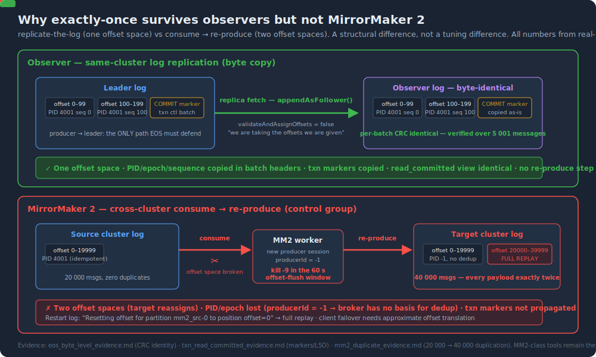

# EOS semantics — why exactly-once survives observer replication for free

  

## The precise claim

Observer replication does not "implement" exactly-once. It **preserves** it, because the replication path sits entirely outside the surface EOS defends.

Kafka's exactly-once machinery (idempotent producer, transactions, read-process-write) all guards **the producer → leader write path**. Duplicates can only be created where something *re-produces* — retries, replays, offset reassignment. Follower/observer replication has no such step:

- `UnifiedLog.appendAsFollower()` calls `append(..., validateAndAssignOffsets = false)`. The in-source comment reads *"we are taking the offsets we are given"* (Kafka 3.7.1, `UnifiedLog.scala`).
- The entire `LogValidator` (offset assignment, dedup checks) runs **only** on the leader path.
- RecordBatch headers — `baseOffset`, `producerId`, `producerEpoch`, `baseSequence`, transactional COMMIT/ABORT control markers — travel inside the copied bytes.
- Producer state and LSO (last stable offset) are rebuilt deterministically on every replica from those bytes, so `read_committed` views are identical everywhere.

## Real-machine evidence (all files in [`evidence/`](../evidence/))

### 1. Byte-level identity — `eos_byte_level_evidence.md`

`kafka-dump-log.sh` on leader vs observer, 5 001 messages:

- every batch's `baseOffset / lastOffset / producerId / producerEpoch / baseSequence / CreateTime / size / position` identical
- **every batch's CRC identical** — not "equivalent", byte-identical

### 2. Transactional consistency — `txn_read_committed_evidence.md`

Transactional producer: 3 committed batches (15 messages) + 1 aborted batch (3 messages).

- `read_committed` consumer against the **leader**: 15 messages, aborted invisible
- `read_committed` consumer against the **observer**: the same 15 messages, aborted invisible
- → COMMIT/ABORT markers replicated as ordinary batches; LSO rebuilt correctly on the observer

### 3. The control group — MirrorMaker 2 — `mm2_duplicate_evidence.md`

Same class of failure applied to a *consume-then-reproduce* replicator:

- Source: 20 000 messages (idempotent producer, zero source duplicates)
- MM2 killed with `kill -9` inside the offset-flush window (default 60 s), restarted
- MM2 log: `Resetting offset for partition mm2_src-0 to position offset=0` → full replay
- **Target: 40 000 messages — every payload exactly twice**
- Target batches show `producerId = -1`: MM2's producer runs without idempotence, so the target broker has no basis for dedup

## The structural takeaway

| | Same-cluster observer | Cross-cluster (MM2 et al.) |
|---|---|---|
| Model | replicate-the-log | consume → re-produce |
| Offset space | one (identical by construction) | two (target reassigns) |
| PID/epoch/sequence | copied in batch headers | new producer session |
| Transaction markers | copied | not propagated |
| Failure semantics | no re-produce step exists | at-least-once (KIP-618 covers only the produce side) |
| Client failover | zero translation | offset translation required, approximate |

This is a structural difference, not a tuning difference. If you need strongly-consistent replication that preserves EOS, it has to be same-cluster log replication — which is what observers are. Cross-region DR still belongs to MM2-class tools (plus downstream idempotence); the two solve different problems.
