# Runbook — Scenario A: one primary AZ is lost

<p align="center">
  
</p>

<p align="center">
  
</p>

**Topology assumed**: primary replicas on a fast AZ pair (e.g. 1c+1d), observer in a third AZ (e.g. 1a). `min.insync.replicas=2`, `acks=all`, `unclean.leader.election.enable=false`.

## What happens at failure

1. The failed AZ's follower drops out of ISR after `replica.lag.time.max.ms`.
2. ISR shrinks below `min.insync.replicas` → producers receive `NOT_ENOUGH_REPLICAS`.
3. This is **fail-stop**: writes stop safely; reads of committed data continue. No wrong data is ever acknowledged.

## Recovery: promote the observer (target: ≤1 minute end-to-end)

```bash
# 0. Pre-check: observer is caught up (it almost always is — it has been fetching continuously)
kafka-topics.sh --bootstrap-server $BS --describe --topic $TOPIC
#    Expect: Replicas: 2,3,1  Isr: 2   (observer=1 absent, failed follower=3 absent)

# 1. On ALL surviving brokers, atomically remove the observer id from the list
#    (write temp file + mv — never edit in place)
echo ""  | sudo tee /opt/kafka/observer.ids.tmp >/dev/null
sudo mv /opt/kafka/observer.ids.tmp /opt/kafka/observer.ids

# 2. Watch ISR recover (5 s file cache + one fetch round-trip; measured ≤10 s)
watch -n 1 "kafka-topics.sh --bootstrap-server $BS --describe --topic $TOPIC"
#    Expect: Isr: 2 → Isr: 2,1   → ISR size back to min.insync.replicas → writes resume automatically
```

**Why this is safe with zero data movement**: the observer's log is byte-identical to the leader's — same offsets, same producer state, same transaction markers (verified: per-batch CRC comparison across 5 001 batches, all identical). Promotion changes its *status*, not its *data*.

## After the failed AZ returns

```bash
# 3. The original follower auto-catches-up and rejoins ISR (native behavior). Verify:
kafka-topics.sh --bootstrap-server $BS --describe --topic $TOPIC   # Isr: 2,1,3

# 4. Demote the observer back (add its id to the file on ALL brokers)
echo "1" | sudo tee /opt/kafka/observer.ids.tmp >/dev/null
sudo mv /opt/kafka/observer.ids.tmp /opt/kafka/observer.ids
#    Native isr-expiration task (every replica.lag.time.max.ms/2, default 15 s) shrinks it out.
#    Measured: ≤10–20 s.
```

**Net result**: leader never changed, offsets never truncated, **RPO = 0**.

## Pre-checks that MUST be scripted (do not skip)

| Before | Check | Why |
|---|---|---|
| Demotion | The broker is not currently a leader (run preferred election first if it is) | The native shrink path never removes the leader itself. **KRaft is stricter** (real-machine finding): a leader-observer demotion never takes effect hot — no ZK-style re-election path exists; move leadership first or restart that broker once |
| Demotion | `ISR − {broker} ≥ min.insync.replicas` | Otherwise the demotion itself triggers fail-stop |
| Promotion | Replica lag ≈ 0 (`kafka-topics --describe` / replica lag metrics) | Promotion of a lagging observer stalls HW until it catches up |
| Promotion (KRaft) | Update `observer.ids` on **controller quorum nodes first**, then brokers | If a broker's gate opens before the controller's, AlterPartition is rejected `INELIGIBLE_REPLICA` until the controller file catches up (fail-safe but adds latency) |
