# Visual guide — every diagram in one place

All diagrams are self-contained animated SVGs (SMIL). GitHub renders the animations natively — no plugins, no video files. Each entry below tells you **how to read the animation** and links to the document that explains it in depth.

> Tip: the animations loop. If you open one mid-cycle, wait for the big phase banner at the top to return to PHASE/STEP 0.

---

## Architecture

### Global architecture

  

**How to read it:** one Kafka cluster spanning 3 AZs. The leader and ISR follower (left) form the acks quorum; the observer (right, dashed purple) runs the same fetch protocol and holds a byte-identical log, but the ISR-boundary gates keep it out of the quorum. The high-watermark advances on ISR replicas only, so the observer can never slow a write. Deep dive: [architecture.md](architecture.md).

### ZooKeeper vs KRaft

  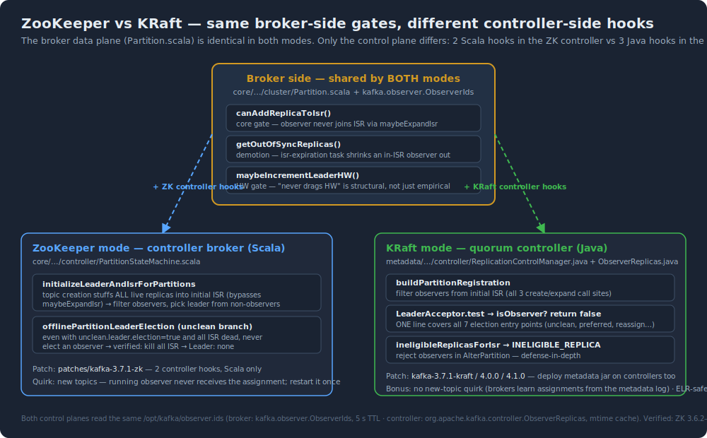

**How to read it:** the broker-side hooks (center) are byte-identical across both modes and all supported versions; only the controller-side hooks differ — Scala state machine in ZK mode, `ObserverReplicas.java` + RCM hooks in KRaft. Full hook matrix and 4.x port analysis: [multi-version.md](multi-version.md).

### Promotion sequence (mechanism view)

  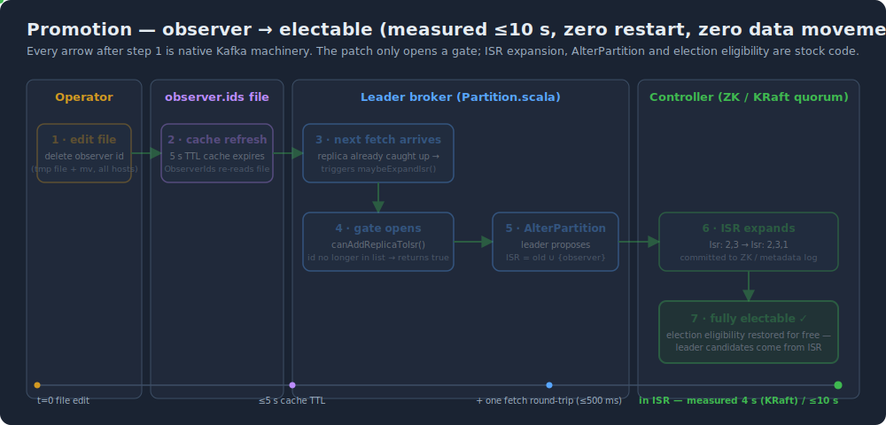

**How to read it:** left to right, the causal chain from one file edit to full election eligibility. The only non-native step is the file edit; everything after — cache refresh, fetch, `canAddReplicaToIsr()`, AlterPartition, ISR expand — is stock Kafka machinery. Measured end-to-end: ≤10 s. Details: [architecture.md](architecture.md).

### Demotion sequence (mechanism view)

  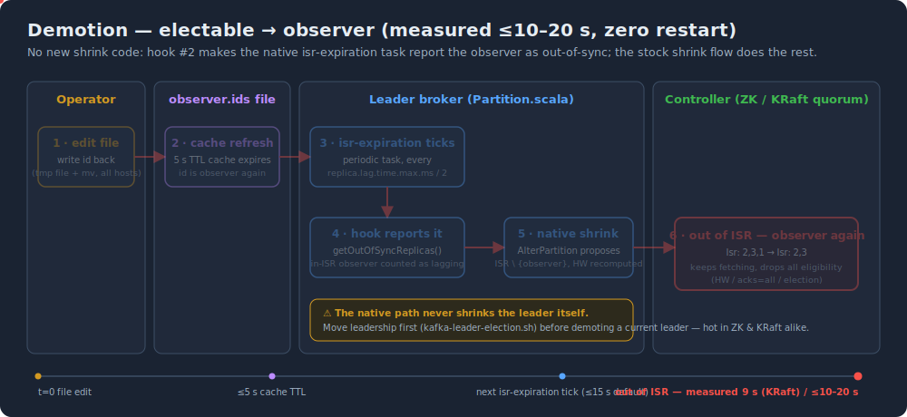

**How to read it:** the reverse path — write the id back, the periodic `isr-expiration` task hits the `getOutOfSyncReplicas` hook, native ISR shrink pushes the broker out (measured ≤10–20 s). Replication continues; only electability is removed. Details: [architecture.md](architecture.md).

### Latency panorama — five real-hardware points on one ruler

  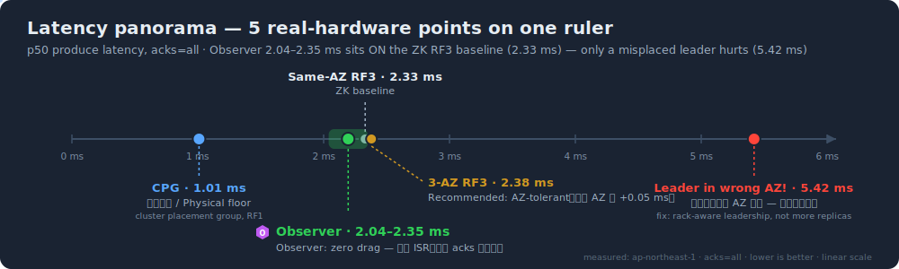

**How to read it:** five measured p50 produce latencies (acks=all, ap-northeast-1) on one linear ruler. The observer point (2.04–2.35 ms) sits **on** the ZK RF3 baseline (2.33 ms) — zero drag, because it is outside the acks critical path. The only real trap is a leader in the wrong AZ (5.42 ms — every message double-hops); fix with rack-aware leadership, not more replicas. Details: [architecture.md](architecture.md).

### Why exactly-once survives (vs MirrorMaker 2)

  

**How to read it:** top path — the observer byte-copies leader batches, so offsets, PIDs, epochs, sequences and txn markers are preserved (per-batch CRCs identical). Bottom path — MM2 consumes and re-produces, creating a new offset space; the control experiment produced 20 000 duplicates under the same failure. Full analysis: [eos-semantics.md](eos-semantics.md).

---

## Lifecycle stories

### Promotion — observer becomes electable

  

**How to read it:** 16 s loop, 5 steps. Watch the ISR boundary box — it physically expands to swallow broker 3 in STEP 3. Every step after the file edit is native Kafka; measured promotion 4–10 s, zero restart, zero data movement. Timing analysis: [timing-and-automation.md](timing-and-automation.md).

### Demotion — electable steps back to observer

  

**How to read it:** the mirror image of promotion, on the RF4 production topology — broker 4 (remote AZ/DC) steps back from ISR member to observer and the ISR boundary contracts to {1, 2, 3}. Measured 9–12 s (KRaft); a pure metadata change — the dashed purple replication stream never stops. Note the warning phase: if broker 4 is currently the **leader**, move leadership first (the native shrink never removes a leader). Details: [timing-and-automation.md](timing-and-automation.md).

### Observer crash — the failure that does not matter

  

**How to read it:** broker 4 (the remote observer) dies and the top row of indicators never changes — ISR stays {1, 2, 3}, the leader keeps acking, producer p50 holds at 2.0 ms. That is the whole point of sitting outside ISR. It restarts, catches up on its own, and the log is verified after reconnect (scenario S3). Details: [timing-and-automation.md](timing-and-automation.md).

---

## Failure stories

### Scenario A — one primary AZ lost

  

**How to read it:** the fail-stop is the feature — writes stop with `NOT_ENOUGH_REPLICAS` instead of silently losing data. One file edit later the observer is in ISR (~9 s) and writes resume with RPO = 0. When the AZ returns, the observer demotes back. Runbook: [runbooks/scenario-a-az-loss.md](runbooks/scenario-a-az-loss.md) · playbook: [scenario-playbook.md](scenario-playbook.md).

### Scenario A — mechanism view (compact)

  

**How to read it:** the compact 4-phase version of Scenario A used in the runbook — steady state → AZ down + fail-stop → one file edit → ISR recovery measured ≤10 s, RPO = 0. The full narrated version is `story-az-loss.svg` above. Runbook: [runbooks/scenario-a-az-loss.md](runbooks/scenario-a-az-loss.md).

### Scenario B — all primary replicas lost

  

**How to read it:** all three ISR members die across three AZs and the key frame is `Leader: none` — the un-promoted observer (broker 4, remote AZ/DC, log byte-identical) refuses to take over **even with unclean election enabled**. Only an explicit promote (empty `observer.ids`) + explicit unclean election makes it lead (~9.4 s from file edit to serving leader, verified with real writes; the md5 pre-check proves zero lag, so unclean is safe here). Note the banner: on RF4 with minISR=2, losing 2 of 3 AZs already fail-stops writes — total loss of all 3 is the extreme case shown. Safety by default, capability on demand. Runbook: [runbooks/scenario-b-total-loss.md](runbooks/scenario-b-total-loss.md).

### observer.ids fail-safe — three injections, zero casualties

  

**How to read it:** three parallel attack columns against the control file — unreadable (`chmod 000`), garbage content, inconsistent copies. Each degrades safely: cached value + WARN, parser drop, controller fence (`INELIGIBLE_REPLICA`) that self-heals in 5.8 s. The file can never take a broker down. Evidence: [scenario-playbook.md](scenario-playbook.md).

---

## Automation stories

### Auto-promoter — the watchdog cycle

  

**How to read it:** 22 s loop, upper half is the cluster, lower half the external daemon. Follow the radar sweep (green → red on detect), the lag check, the atomic file edit, and the audit log filling in on the right. Fault → detect → promote → writes resumed: ≤14 s total, no human. It later **demotes only what it promoted**. Design and safety rules: [auto-promotion.md](auto-promotion.md).

### Three operational modes — Manual / Auto / Hybrid

  

**How to read it:** the same fault replays simultaneously in three columns. Manual trades RTO for determinism (recommended for financial); Auto delivers RTO ≤ 14 s; Hybrid detects fast and decides deliberately. The punchline is the bottom banner: whichever mode you pick, the mechanism underneath is the same one-line file. Mode comparison: [timing-and-automation.md](timing-and-automation.md).

### Dry-run — watch it think before you let it act

  

**How to read it:** in dry-run (`-n`) the daemon runs the full decision path on real faults but the arrow to the cluster is **blocked** — only the log line lands. A human reviews the trace ("would it have promoted at the right moment?"), flips one flag, and the identical detector gains real hands. This is week 1 of the recommended rollout SOP. Details: [auto-promotion.md](auto-promotion.md) · rollout timeline: [timing-and-automation.md](timing-and-automation.md).

---

## Evidence overview

### Verification map — 9 evidence domains

  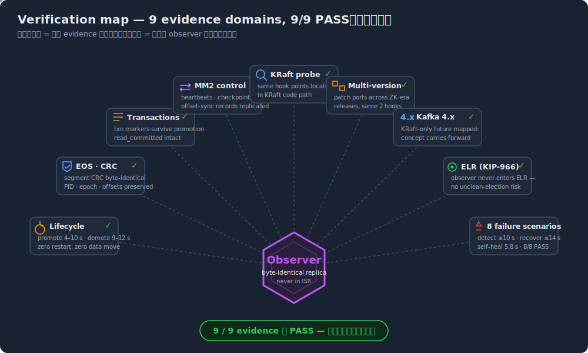

**How to read it:** the observer sits at the center; each radial spoke is one evidence report in [`evidence/`](../evidence/), and the flowing dots are that domain continuously exercising the observer's behavior. All 9 domains PASS on real Tokyo clusters — measured, not paper reasoning. Start here to find which raw report backs which claim.
