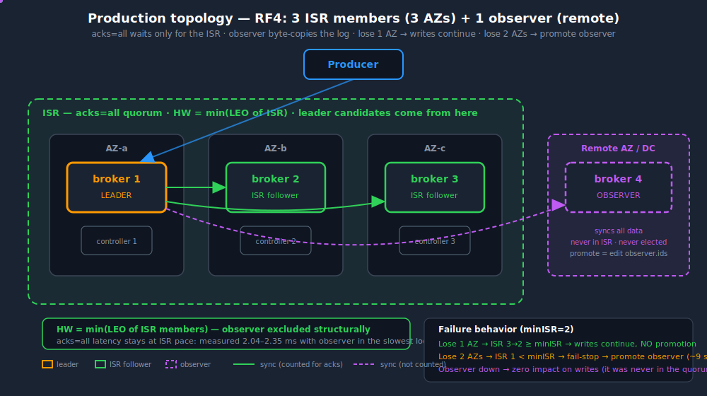
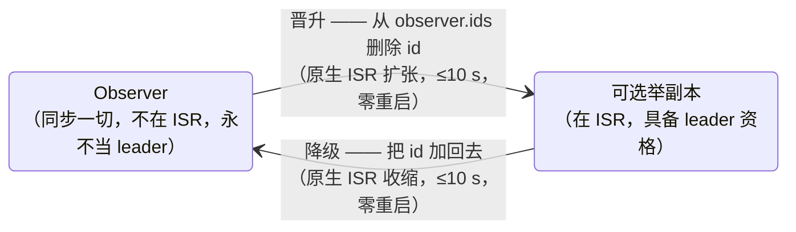

# sample-kafka-observer（中文版）

[](../../LICENSE)
[](../../.github/workflows/build-verify.yml)
[](../../CHANGELOG.md)
[](../multi-version.md)

**Apache Kafka 的 Observer/Learner 副本 —— 开源参考实现。**

给开源 Apache Kafka 加上第三种副本状态：**全量同步数据、但永不加入 ISR** 的副本 —— 它不拖高水位（HW）、不参与选主，并且可以在数秒内**晋升为完全可选举的副本，零重启、零数据搬迁**。

> 本仓库中的每一个数字都在真实 EC2 实例上测得（东京，3 broker 跨 3 AZ，m7g.large）。含原始命令输出的证据文件在 [`evidence/`](../../evidence/)。设计如何经过三轮 POC 迭代演化而来：[design-story.md](../design-story.md)（英文）。

## 为什么会有这个项目

交易所、支付账本、订单簿这类业务，需要在**慢 AZ 或异地放一个强一致、字节级一致的备份副本**，但绝不能让它拖慢主写入链路。原生 Kafka 只给两个选择：

- 把远端副本**放进 ISR** → `acks=all` 要等它，高水位由最慢的 ISR 成员决定，主链路直接继承跨 AZ 延迟。（我们先实测了纯配置方案：一致性达标，但 HW 被拖累。）
- 把它放到**集群之外**，走跨集群复制（MirrorMaker 2 等）→ *消费 → 再生产*：目标集群重新分配 offset，exactly-once 结构上不可能，客户端切换还要做 offset 翻译。同样的故障下（offset 刷盘窗口内一次 `kill -9`），我们的 MM2 对照组重复投递了 **20,000 条消息**（[证据](../../evidence/mm2_duplicate_evidence.md)）。

业界的答案是第三种副本状态 —— 同步一切、但对 acks/HW/选举完全隐身的副本：

- **Confluent Multi-Region Clusters（MRC）Observers** —— 商业闭源方案。
- 某些大型科技公司内部的 **Learner 副本** —— 内部 fork，未开源。
- **Apache Kafka 上游** —— 没有。KIP-929 "Observer Replicas" 是一个**正文长度为零**的 wiki 页面（经 Confluence API 验证）：占位符，不是计划。

所以今天需要这个能力的用户只有三条路：买 Confluent、自己维护 fork、或者用一套持续维护、可审计的 patch —— 本项目就是第三条路：**约 60 行 Scala、5 个 hook 点**（ZooKeeper 模式；加上 KRaft controller 侧约 115 行），全部复用 Kafka 原生的 ISR 扩缩机制，每一条声明都有原始证据文件背书。同集群 observer 是*复制日志*而非*消费再生产*：不存在第二个 offset 空间，所以 exactly-once 天然免费保留 —— 见 [eos-semantics.md](../eos-semantics.md) 与[业界方案对比](../industry-comparison.md)。

## 你得到什么

| 能力 | 机制 | 已验证 |
|---|---|---|
| 全量同步、永不进 ISR | `canAddReplicaToIsr()` 闸门 | ✅ `Replicas: 2,3,1` 而 `Isr: 2,3` |
| 永不拖高水位 | `maybeIncrementLeaderHW` 闸门 | ✅ observer 在最慢 AZ 时 acks=all 仍为 2.04–2.35 ms |
| 永不当 leader（含 unclean 选举） | 初始 ISR 排除 + unclean 选举排除 | ✅ kill 全部 ISR → `Leader: none` |
| **晋升**（observer → 可选举） | 从 `/opt/kafka/observer.ids` 删除 id → 下一次 fetch 通过闸门 → 原生 ISR 扩张 | ✅ ≤10 s，零重启 |
| **降级**（可选举 → observer） | 把 id 加回文件 → 原生 `isr-expiration` 任务将其收缩出 ISR | ✅ ≤10 s，零重启 |
| 晋升后的副本可当 leader 并服务 | 完整恢复选举资格 | ✅ kill 全部 ISR → `Leader: 1`，读写正常 |
| Exactly-once 保留 | `appendAsFollower` 字节级复制 leader batch —— offset、PID、epoch、sequence、事务 marker | ✅ 逐 batch CRC 一致；`read_committed` 视图一致；MM2 对照组在相同故障下产生 20,000 条重复 |

## 架构

<p align="center">
  
</p>

Observer 走原生 follower fetch 协议，持有字节级一致的日志副本，但 ISR 边界上的闸门把它挡在外面 —— 因此它不拖 `acks=all`、不计入 `min.insync.replicas`、永不当选 leader（连 unclean 选举也不行）。晋升与降级只需改一行文件，热生效：



"不在 ISR" 为什么能推导出其余一切、5 个 hook 点、晋升/降级时序图：[architecture.md](../architecture.md) · 监控告警指引：[monitoring-alerting.md](../monitoring-alerting.md)。

## 快速开始

```bash
# 1. 获取干净的 Kafka 源码（此处以 3.7.1 为例；4.0.0/4.1.0 用对应 patch 目录 —— 见 docs/multi-version.md）
git clone --depth 1 --branch 3.7.1 https://github.com/apache/kafka.git kafka-src

# 2. 应用 patch（仅 ZK：kafka-3.7.1-zk；ZK+KRaft 合并版：kafka-3.7.1-kraft；
#    Kafka 4.x：kafka-4.0.0-kraft / kafka-4.1.0-kraft）
cd kafka-src && git apply --3way ../patches/kafka-3.7.1-zk/observer.patch

# 3. 编译（需要带 javac 的 JDK 17；4 vCPU 约 1–3 分钟）
./gradlew :core:jar -x test          # 仅 ZK patch
# ./gradlew :core:jar :metadata:jar :storage:jar -x test   # KRaft / 合并版 patch

# 4. 部署：替换每台 broker 上的 kafka_2.13-3.7.1.jar 和 kafka-storage-3.7.1.jar
#    （KRaft：还有 kafka-metadata-*.jar，controller 节点也要），
#    创建 /opt/kafka/observer.ids 写入 observer broker id，滚动重启。

# 5. 验证
kafka-topics.sh --describe --topic your_topic   # Isr 中不含 observer id
```

想在本机体验？`cd docker && docker compose up -d && ./demo.sh` 在本地 3-broker 集群上走完整生命周期（[docker/README.md](../../docker/README.md)）。完整部署指南（含滚动替换 SOP）：[deployment.md](../deployment.md)。

## ZooKeeper vs KRaft

两种模式都支持，observer 语义、文件格式、runbook 完全一致 —— ZK→KRaft 迁移期间能力无缝衔接。差异只在控制面不同的地方：

| | ZooKeeper 模式（3.6–3.9） | KRaft 模式（3.7.1 / 4.0 / 4.1） |
|---|---|---|
| Broker 侧 hook | `Partition.scala` × 3（晋升闸门、降级钩子、HW 闸门） | **完全相同** —— 两种模式共享同一文件；锚点代码 3.6.2 → 4.1.0 逐字一致 |
| Controller 侧 hook | `PartitionStateMachine.scala` × 2（Scala：初始 ISR、unclean 选举） | `ObserverReplicas.java` + `ReplicationControlManager` 3 处 hook（Java，`metadata` 模块）；`LeaderAcceptor.test` **一行覆盖全部 7 个选举入口** |
| Patch 规模 | ~60 行 | ~115 行 |
| 需部署的 jar | `core` + `storage` | `core` + `storage` + `metadata` —— **controller quorum 节点也要** |
| `observer.ids` 分发 | 所有 broker（controller 就是某台 broker） | 所有 broker **加** controller 节点；晋升时**先更新 controller**（broker 先开闸会被拒 `INELIGIBLE_REPLICA`，直到 controller 文件一致 —— 方向安全，但增加时延） |
| 新建 topic 的坑 | 运行中的 observer 收不到新 topic 的分配（controller 只通知 ISR 成员）—— 建完跨 observer 的 topic 后重启该 observer 一次 | **没有此限制** —— broker 从 metadata log 读取全部分配（探针实证） |
| 降级"当前是 leader"的 observer | 先迁移 leadership（原生收缩路径不会移除 leader 自己） | **更严格**：leader 的热降级永不生效（无 ZK 式重选举路径）—— 先迁 leadership 或重启该 broker 一次 |
| 额外防御 | — | controller 侧直接拒绝 observer 的 AlterPartition（`INELIGIBLE_REPLICA "observer"`），即使 broker 侧闸门缺失也兜底 |
| ELR（KIP-966） | 不适用 | Observer 结构性地永不进 ELR（候选集 = `ELR ∪ ISR`）；4.0（手动开启）与 4.1（默认开启）均真机验证。要用 ELR 请上 4.1.0（含 KAFKA-19522 修复） |

完整 hook 矩阵、4.x 逐 hunk 移植分析、以及发现 controller 侧缺口的 KRaft 探针：[multi-version.md](../multi-version.md)。

## 故障演练手册

以下每个场景都在真实集群上执行过 —— 演练台账（做了什么、看到了什么、原始输出在哪）见 [scenario-playbook.md](../scenario-playbook.md)：

- **场景 A —— 一个主 AZ 挂掉**：写入 fail-stop（`NOT_ENOUGH_REPLICAS`）→ 从文件删除 observer id → observer ≤10 s 进入 ISR → 写入恢复。零数据搬迁（数据本来就字节级一致）。RPO = 0。[runbook](../runbooks/scenario-a-az-loss.md)
- **场景 B —— 全部主副本挂掉**：未晋升的 observer *永不*当选（即使 unclean 选举开启也是 `Leader: none`）→ 晋升后当选 leader 并提供读写。[runbook](../runbooks/scenario-b-total-loss.md)
- 前置检查、多 observer 布局、KRaft 专属规则：[runbooks/](../runbooks/)

## 版本支持

| Kafka 版本 | 模式 | 状态 |
|---|---|---|
| 3.7.1 | ZooKeeper | ✅ 真机集群验证（v0.3，[证据](../../evidence/observer_v3_lifecycle_evidence.md)） |
| 3.7.1 | **KRaft** | ✅ **8 项能力矩阵全部通过**（v0.5）：初始 ISR 过滤、unclean 选举拒绝、晋升 4 s / 降级 9 s、晋升后当 leader 服务、新 topic 即时 fetch。Controller 侧 Java patch（`ObserverReplicas.java` + 3 处 RCM hook），combined 与 controller-only 两种拓扑均验证。[证据](../../evidence/kraft_controller_patch_evidence.md) |
| 3.6.2 / 3.8.1 / 3.9.1 | ZooKeeper | ✅ canonical patch 干净 apply + 编译通过（真机，[证据](../../evidence/multiversion_apply_evidence.md)）；每周 CI 漂移哨兵 |
| 4.0.0 | **KRaft** | ✅ **真机 6 节点集群验证**（v0.6，3 controller + 3 broker）：3.7.1 patch 的 8 个可用 hunk 仅有行号漂移即全部应用（2 个 ZK-controller hunk 弃用 —— Kafka 4.0 删除了 ZooKeeper）；能力矩阵全部通过 —— 初始 ISR 过滤、全量同步、晋升 ~4 s / follower 降级 ~12 s、晋升后 preferred 选举、unclean 选举拒绝（`Leader: none`，零数据丢失）。手动开启 ELR 后复测：observer 永不进 ELR/LastKnownElr。[移植证据](../../evidence/kafka40_port_evidence.md) · [ELR 证据](../../evidence/elr_verification_evidence.md) |
| 4.1.0 | **KRaft** | ✅ **真机 6 节点集群验证**（v0.6）：patch 与 4.0.0 逐字节一致（仅 hunk 偏移不同），编译干净。ELR 对新建 4.1 集群**默认开启** —— 验证 observer 结构性地永不进 ELR/LastKnownElr，即使 `unclean.leader.election.enable=true` 也永不当选；ELR 成员回归时干净选主、零数据丢失。含上游 KAFKA-19522 修复（3.7.1/4.0.0 存在的 fenced last-known-leader 误选举）。[证据](../../evidence/elr_verification_evidence.md) |

Patch 目录：[`patches/kafka-3.7.1-zk/`](../../patches/kafka-3.7.1-zk/)（仅 ZK）、[`patches/kafka-3.7.1-kraft/`](../../patches/kafka-3.7.1-kraft/)（**ZK+KRaft 合并** —— 一套 build 两模式通吃；部署 `core` + `storage` + `metadata` jar）、[`patches/kafka-4.0.0-kraft/`](../../patches/kafka-4.0.0-kraft/) 与 [`patches/kafka-4.1.0-kraft/`](../../patches/kafka-4.1.0-kraft/)（纯 KRaft —— 上游 4.0 已删除 ZooKeeper）。完整决策依据：[multi-version.md](../multi-version.md)。

## 运维能力

围绕核心 patch 的运维工具（另见[监控告警](../monitoring-alerting.md)）：

- **晋升 / 降级脚本**：[`scripts/observer-promote.sh`](../../scripts/observer-promote.sh) / [`scripts/observer-demote.sh`](../../scripts/observer-demote.sh) —— 原子文件写入 + 前置检查。
- **可选的自动晋升守护进程**（`under-min-isr` 策略，**默认关闭** —— 金融类负载推荐确定性的人工操作）：[`scripts/observer-auto-promoter.sh`](../../scripts/observer-auto-promoter.sh) + [systemd 单元](../../deploy/observer-auto-promoter.service)，设计与风险边界见 [auto-promotion.md](../auto-promotion.md)。

## 项目结构

```
patches/     每个 Kafka 版本的 canonical observer.patch；archive/ 保留 v0.1/v0.2/v0.3 三轮 POC 迭代
docs/        架构 · 设计故事 · 部署 · runbook · 演练台账 · 多版本 · FAQ · 中文文档 (zh/)
evidence/    真机验证原始报告 —— README 中每一条声明都可追溯到其中一份
scripts/     observer-promote / observer-demote / 可选 auto-promoter
tools/       apply-and-build.sh · generate-patch.py · check-anchors.sh（离线锚点漂移哨兵）
docker/      本地 3-broker 验证环境（从源码构建 patched Kafka）
terraform/   产出 evidence/ 中所有数字的东京 3-AZ POC 拓扑
test/        对活集群运行的 pytest 集成测试
deploy/      systemd 单元
```

## 证据驱动开发

本仓库只有一条纪律：**没有原始证据文件就没有声明。** 上面表格里的每项能力都链接到 [`evidence/`](../../evidence/) 中的一份报告，内含真实 EC2 集群上执行的命令与原始输出 —— 包括不好看的结果（MM2 的重复条数、证明两个 hook 在 KRaft 下*不*生效的探针、leader 降级限制、一个确认的上游 bug）。报告中的陈述区分"事实"与"推断"，负面结果照发不藏。当一条声明升级时（例如从"锚点看起来一致"升到"patch 在每个版本上都能 apply 并编译"），证据是重新采集的，不是外推的。产生这套设计的三轮迭代 —— 包括途中发现并修复的两个漏洞 —— 作为一篇"如何做系统研究"的示范写在 [design-story.md](../design-story.md)。最初的东京 POC 中文报告：[POC验证报告.md](POC验证报告.md)。

## FAQ

与 KIP-966 的关系、为什么不等上游、与 Confluent MRC 的差异、再分发的合规性、跨版本维护成本、多 observer 布局：[faq.md](../faq.md)。

## 项目状态与版本

当前版本：**v0.6**（ZK 3.6–3.9 + KRaft 3.7.1 / 4.0.0 / 4.1.0，ELR 兼容性已验证）。v0.7+ 路线图（metrics、自动晋升策略）见 [ROADMAP.md](../../ROADMAP.md)。变更历史：[CHANGELOG.md](../../CHANGELOG.md)。英文版 README：[README.md](../../README.md)。

## 许可与商标说明

Patch 以 Apache License 2.0 提供。用这些 patch 构建的二进制是 **Apache Kafka 的修改版** —— 若再分发，必须标注为修改版（NOTICE），且不得称其为 "Apache Kafka"。本项目与 Apache 软件基金会、Confluent 均无关联。
